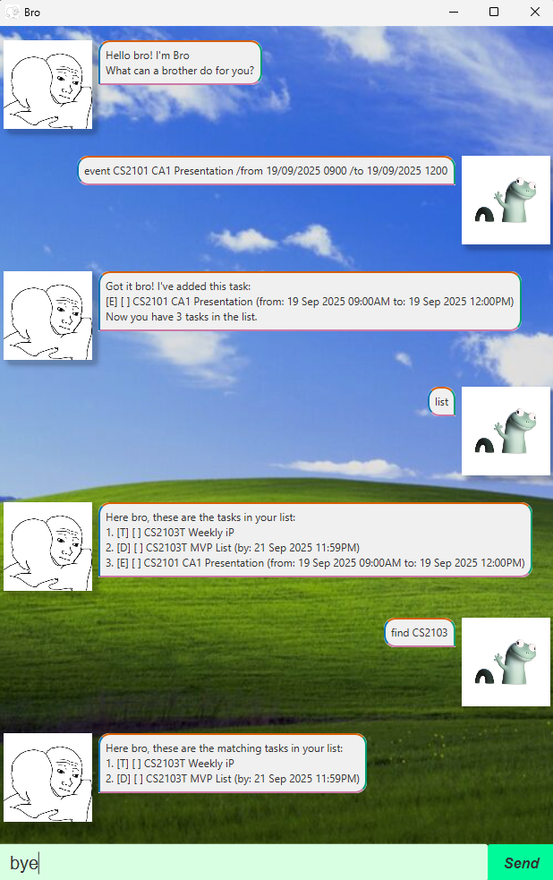

# Bro User Guide



Bro is your personal companion for managing tasks, deadlines, and events. Bro helps you keep track of what matters, so you can focus on being awesome.

## Table of Contents

- [Quick Start](#quick-start)
- [Features](#features)
  - [1. Adding a Task](#1-adding-a-task-todo-deadline-event)
  - [2. Marking and Unmarking a Task as Done](#2-marking-and-unmarking-a-task-as-done)
  - [3. Finding a Task](#3-finding-a-task)
  - [4. Listing Tasks](#4-listing-tasks)
  - [5. Deleting Tasks](#5-deleting-tasks)
  - [6. Exiting the App](#6-exiting-the-app)
- [Saving Data](#saving-data)
- [Frequently Asked Questions](#frequently-asked-questions)


## Quick Start

1. **[Download the latest release of Bro](https://github.com/codewallie/ip/releases)** and ensure you have Java 17 installed.
2. **Open a terminal**, create new empty directory where you want Bro to be saved and move `bro.jar` into it. `cd` into that directory.
3. **Run Bro** using the command:
   ```
   java -jar bro.jar
   ```

## Features

### 1. Adding a Task: Todo, Deadline, Event

Bro supports three types of tasks:

#### ***`todo`***
Add a simple task.

**Usage:**
`todo <description>`

**Example:**
`todo buy groceries`

**Expected Output:**
```
Got it bro! I've added this task:
  [T][ ] buy groceries
Now you have 1 tasks in the list.
```

#### ***`deadline`***
Add a task with a deadline.

**Usage:**
`deadline <description> /by <date time>`

**Example:** 
`deadline submit assignment /by 20/09/2025 2359`

**Expected Output:**
```
Got it bro! I've added this task:
  [D][ ] submit assignment (by: 20/09/2025 2359)
Now you have 2 tasks in the list.
```

#### ***`event`***
Add an event with a start and end time.

**Usage:**
`event <description> /from <date time> /to <date time>`

**Example:**
`event team meeting /from 21/09/2025 1400 /to 21/09/2025 1500`

**Expected Output:**
```
Got it bro! I've added this task:
  [E][ ] team meeting (from: 21/09/2025 1400 to: 21/09/2025 1500)
Now you have 3 tasks in the list.
```

---

### 2. Marking and Unmarking a Task as Done

#### ***`mark`***
Mark a task as done.

**Usage:**
`mark <task number>`

**Example:**
`mark 2`

**Expected Output:**
```
Good one bro! I've marked this task as done:
  [D][X] submit assignment (by: 20/09/2025 2359)
```

#### ***`unmark`***
Unmark a task as not done.

**Usage:**
`unmark <task number>`

**Example:**
`unmark 2`

**Expected Output:**
```
Aights bro! I've marked this task as not done yet:
  [D][ ] submit assignment (by: 20/09/2025 2359)
```

---

### 3. Finding a Task

#### ***`find`***
Find tasks containing a keyword.

**Usage:**
`find <keyword>`

**Example:**
`find assignment`

**Expected Output:**
```
Here bro, these are the matching tasks in your list:
  2. [D][ ] submit assignment (by: 20/09/2025 2359)
```

#### ***`tasks on`***
Find tasks on a specific date.

**Usage:**
`tasks on <date>`

**Example:**
`tasks on 20/09/2025`

**Expected Output:**
```
Here bro, these are the tasks on 20/09/2025:
  2. [D][ ] submit assignment (by: 20/09/2025 2359)
```

---

### 4. Listing Tasks

List all tasks.

**Usage:**
`list`

**Expected Output:**
```
Here bro, these are the tasks in your list:
  1. [T][ ] buy groceries
  2. [D][ ] submit assignment (by: 20/09/2025 2359)
  3. [E][ ] team meeting (from: 21/09/2025 1400 to: 21/09/2025 1500)
```

---

### 5. Deleting Tasks
Delete a task by its number.

**Usage:**
`delete <task number>`

**Example:**
`delete 1`

**Expected Output:**
```
Sure bro! I've removed this task:
  [T][ ] buy groceries
Now you have 2 tasks in the list.
```

---

### 6. Exiting the App
Exit Bro.

**Usage:**
`bye`

**Expected Output:**
```
Oh, going already? Bye bro, see you next time!
```

---

## Saving Data

Bro automatically saves your tasks to a file (`./data/bro.txt`) after every change.  
When you restart Bro, your tasks will be loaded from this file.

---

## Frequently Asked Questions

**Q: What date format should I use?**  
A: Use `dd/MM/yyyy HHmm` (e.g., `20/09/2025 2359`).

**Q: Where is my data stored?**  
A: In the `./data/bro.txt` file in the project directory.

**Q: What happens if I enter an invalid command?**  
A: Bro will let you know and prompt you to try again.

**Q: How do I get help?**  
A: Type any invalid command to see an error message, or refer to this guide.

---
